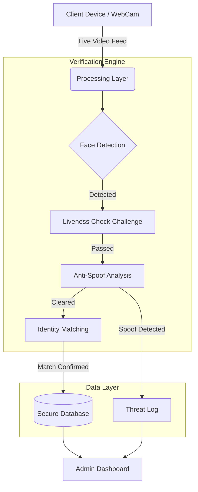

<!-- Banner Image Suggestion: A modern, dark-mode dashboard interface with a glowing facial recognition scanning box overlapping an attendance grid. (E.g. ``) -->

# 👁️ Attendance Verifier

**Zero-Trust Smart Attendance Management & Identity Verification System**

[Overview](#-overview) •
[Features](#-key-features) •
[Architecture](#-system-architecture) •
[Intelligence](#-core-intelligence)

 

## ⚡ Overview: The Proxy Problem

Traditional attendance systems rely on vulnerable processes—roll calls, ID cards, or simple PINs. These are easily exploited, leading to proxy attendance, human error, and massive time consumption. **Attendance Verifier** eliminates these vulnerabilities using multi-layer biometric validation.

| ❌ The Problem | ✨ The Verifier Solution |
| :--- | :--- |
| **Proxy Attendance:** Students/employees marking peers present using shared IDs. | **Identity Validation:** Biometric verification ensures the physical presence of the individual. |
| **Time Consumption:** Manual roll calls eat into productive operational or educational hours. | **Automated Logging:** Millisecond verification automatically logs timestamps without intervention. |
| **Spoofing Attacks:** Holding up static photos or phone screens to trick standard cameras. | **Liveness Detection:** Challenge-response systems block static images and flat-surface reflection. |

 

## 🔥 Key Features

<table>
  <tr>
    <td>
      <h3>🎯 Smart Verification  Engine</h3>
      
Multi-step validation pipeline that analyzes visual input to confirm identity before allowing a database entry to be written.

    </td>
    <td>
      <h3>👤 Identity Validation & Liveness</h3>
      
Uses active challenge-response (e.g., "blink twice") and 3D depth analysis to distinguish a live human from a photograph or screen.

    </td>
  </tr>
  <tr>
    <td>
      <h3>⚡ Automated Logging</h3>
      
Zero-click attendance tracking. Once verification is confirmed, timestamps, device IDs, and confidence scores are immediately synced.

    </td>
    <td>
      <h3>📊 Real-Time Analytics Dashboard</h3>
      
Administrator portal featuring live verification streams, spoof-attempt alerts, and systemic risk-level monitoring.

    </td>
  </tr>
</table>

 

## 🏗️ System Architecture

 

## 🔄 Working Flow

> **1. Capture** ➔ User positions face within the camera reticle. 
> **2. Challenge** ➔ System prompts a random liveness challenge (e.g., subtle head movement). 
> **3. Analysis** ➔ Engine checks for depth, edge anomalies, and reflections to prevent screen spoofing. 
> **4. Record** ➔ Upon >95% confidence score, attendance is securely recorded. Multiple failures trigger an automatic ban. 

 

## 🛠️ Technology Stack

| Domain | Technologies |
| :--- | :--- |
| **Frontend** | `React` `Vite` `Tailwind CSS v4` `Shadcn/UI` |
| **Camera/Media** | `react-webcam` `MediaDevices API` |
| **Routing & State** | `Wouter` `React Hook Form` |
| **Data Visualization** | `Recharts` `Lucide Icons` |

 

## 🧪 Core Intelligence & Logic

The system utilizes a staged confidence-scoring model to ensure high accuracy and security:

* **Bounding Box Tracking:** Initial logic ensures a face is centered, properly lit, and clear of occlusions.
* **Liveness Validation:** Implements randomized physical challenges that a static image cannot replicate.
* **Spoof Detection Rules:** Analyzes the video feed for flat edges, screen refresh rates (Moiré patterns), and unnatural lighting reflections to block digital proxy attempts.
* **Three-Strike Protocol:** If a user fails the anti-spoofing checks three times consecutively, the system locks the session and dispatches an alert to administrators.

 

## 📊 Impact

* **100% Proxy Elimination:** Ensures attendance records represent actual physical presence.
* **Frictionless Experience:** Reduces the time to mark attendance from minutes to seconds.
* **Actionable Analytics:** Provides administrators with real-time insight into attendance trends and security anomalies.

 

## 🚀 Future Scope

* **Mobile App Integration:** Native iOS/Android clients utilizing internal FaceID/hardware sensors.
* **Cloud Edge Processing:** Offloading heavy verification logic to edge servers to support lower-end devices.
* **Advanced AI Recognition:** Integration with Python-based backend ML models (OpenCV/Dlib) for enterprise-scale face matching.

 

---

  
**Securing operations, one verification at a time.**

